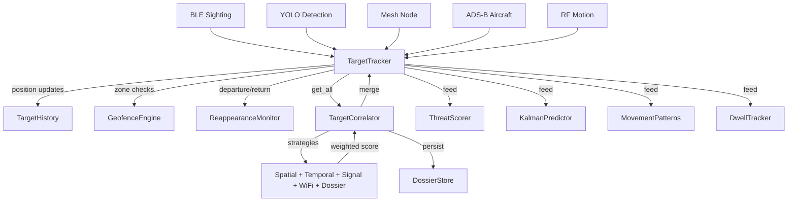

# tritium_lib.tracking

Core target tracking, identity resolution, and behavioral analysis -- every sensor detection flows through here.

**Where you are:** `tritium-lib/src/tritium_lib/tracking/`

## How It Works



## Files

| File | Description |
|------|-------------|
| `__init__.py` | Package exports -- 70+ public symbols |
| `target_tracker.py` | `TargetTracker` and `TrackedTarget` -- thread-safe target registry with confidence decay |
| `correlator.py` | `TargetCorrelator` -- multi-strategy identity resolution with graph store integration |
| `correlation_strategies.py` | `SpatialStrategy`, `TemporalStrategy`, `SignalPatternStrategy`, `WiFiProbeStrategy`, `DossierStrategy`, `ConfidenceCalibrator` |
| `dossier.py` | `DossierStore` and `TargetDossier` -- persistent cross-session identity records |
| `target_history.py` | `TargetHistory` -- ring-buffer position trail per target (up to 1000 points) |
| `target_reappearance.py` | `TargetReappearanceMonitor` -- detects when lost targets return |
| `target_prediction.py` | Linear velocity extrapolation at 1/5/15 min horizons |
| `kalman_predictor.py` | Kalman filter state estimator [x, y, vx, vy, ax, ay] |
| `geofence.py` | `GeofenceEngine` -- polygon zone monitoring with ray-casting enter/exit detection |
| `trilateration.py` | `TrilaterationEngine` -- BLE position estimation from multi-node RSSI |
| `heatmap.py` | `HeatmapEngine` -- grid-based spatial activity accumulator |
| `dwell_tracker.py` | `DwellTracker` -- stationary loitering detection with concentric ring alerts |
| `ble_classifier.py` | `BLEClassifier` -- known/unknown/new/suspicious MAC classification |
| `vehicle_tracker.py` | `VehicleTrackingManager` -- speed, heading, and suspicious behavior scoring |
| `vehicle_pipeline.py` | `VehiclePipeline` -- multi-sensor vehicle classification, route estimation, parking events |
| `convoy_detector.py` | `ConvoyDetector` -- flags 3+ targets moving together |
| `threat_scoring.py` | `ThreatScorer` -- behavior-based threat probability (loitering, zone violations, timing) |
| `escalation.py` | Threat level classification: none -> unknown -> suspicious -> hostile |
| `patrol.py` | `PatrolManager` -- autonomous waypoint route advancement |
| `network_analysis.py` | `NetworkAnalyzer` -- WiFi probe bipartite graph (device <-> SSID) |
| `proximity_monitor.py` | `ProximityMonitor` -- entity-to-entity proximity alerting |
| `person_reid.py` | `ReIDEngine` -- cross-sensor person re-identification despite MAC rotation |
| `sensor_health_monitor.py` | `SensorHealthMonitor` -- flags sensors that go quiet |
| `movement_patterns.py` | `MovementPatternAnalyzer` -- regular routes, loitering, deviations |
| `obstacles.py` | `BuildingObstacles` -- OSM building polygons for collision detection |
| `street_graph.py` | `StreetGraph` -- NetworkX road graph from OSM for pathfinding |

## Usage

```python
from tritium_lib.tracking import TargetTracker, TargetCorrelator

tracker = TargetTracker()
tracker.update_from_ble({"mac": "AA:BB:CC:DD:EE:FF", "rssi": -55})
correlator = TargetCorrelator(tracker, confidence_threshold=0.3)
correlator.correlate()  # run one pass
```

**Parent:** [../README.md](../README.md)
