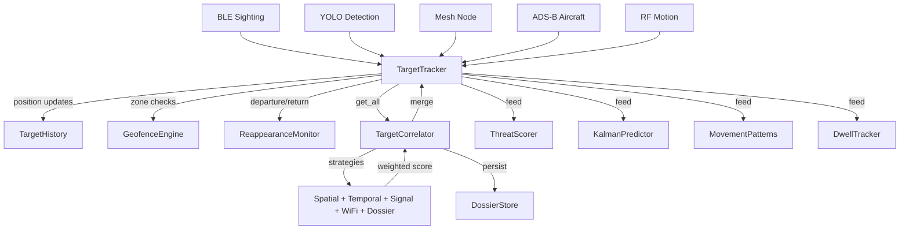

# tritium_lib.tracking

Core target tracking, identity resolution, and behavioral analysis -- every
sensor detection flows through here, and `TargetTracker` is the single
authority for a target's identity, position, and **effective alliance**.

**Where you are:** `tritium-lib/src/tritium_lib/tracking/`

## How It Works



## Files

| File | Description |
|------|-------------|
| `__init__.py` | Package exports -- 70+ public symbols |
| `target_tracker.py` | `TargetTracker` and `TrackedTarget` -- thread-safe target registry with confidence decay |
| `correlator.py` | `TargetCorrelator` -- multi-strategy identity resolution with graph store integration |
| `correlation_strategies.py` | `SpatialStrategy`, `TemporalStrategy`, `SignalPatternStrategy`, `WiFiProbeStrategy`, `DossierStrategy`, `ConfidenceCalibrator` |
| `dossier.py` | `DossierStore` and `TargetDossier` -- persistent cross-session identity records |
| `dossier_manager.py` | `DossierManager` -- EventBus bridge between the real-time `TargetTracker` and the persistent `DossierStore`; unified dossier API + `entity_type_for_class` (extracted sc->lib, 2026-07). The package's second-largest module. |
| `integrity.py` | RAIM-style track-integrity gating -- tests each new fix against a constant-velocity prediction (normalized innovation) to catch GPS-spoof teleports a fixed max-speed threshold would miss. |
| `target_history.py` | `TargetHistory` -- ring-buffer position trail per target (up to 1000 points) |
| `target_reappearance.py` | `TargetReappearanceMonitor` -- detects when lost targets return |
| `target_prediction.py` | Linear velocity extrapolation at 1/5/15 min horizons |
| `kalman_predictor.py` | Kalman filter state estimator [x, y, vx, vy, ax, ay] |
| `geofence.py` | `GeofenceEngine` -- polygon zone monitoring with ray-casting enter/exit detection |
| `trilateration.py` | `TrilaterationEngine` -- BLE position estimation from multi-node RSSI |
| `heatmap.py` | `HeatmapEngine` -- grid-based spatial activity accumulator |
| `dwell_tracker.py` | `DwellTracker` -- stationary loitering detection with concentric ring alerts |
| `ble_classifier.py` | `BLEClassifier` -- known/unknown/new/suspicious MAC classification |
| `vehicle_tracker.py` | `VehicleTrackingManager` -- speed, heading, and suspicious behavior scoring |
| `vehicle_pipeline.py` | `VehiclePipeline` -- multi-sensor vehicle classification, route estimation, parking events |
| `convoy_detector.py` | `ConvoyDetector` -- flags 3+ targets moving together |
| `threat_scoring.py` | `ThreatScorer` -- behavior-based threat probability (loitering, zone violations, timing) |
| `escalation.py` | Threat level classification: none -> unknown -> suspicious -> hostile |
| `patrol.py` | `PatrolManager` -- autonomous waypoint route advancement |
| `network_analysis.py` | `NetworkAnalyzer` -- WiFi probe bipartite graph (device <-> SSID) |
| `proximity_monitor.py` | `ProximityMonitor` -- entity-to-entity proximity alerting |
| `person_reid.py` | `ReIDEngine` -- cross-sensor person re-identification despite MAC rotation |
| `sensor_health_monitor.py` | `SensorHealthMonitor` -- flags sensors that go quiet |
| `movement_patterns.py` | `MovementPatternAnalyzer` -- regular routes, loitering, deviations |
| `obstacles.py` | `BuildingObstacles` -- OSM building polygons for collision detection |
| `street_graph.py` | `StreetGraph` -- NetworkX road graph from OSM for pathfinding |

## Alliance authority (the 2026-07-11 ruling)

`TargetTracker` is the **sole writer** of a target's *effective* alliance, so
the live map, REST `/api/targets`, CoT export, and fusion can never disagree
about whose side a unit is on. Every `TrackedTarget` carries an
`alliance_source` field recording which precedence tier last wrote its
alliance (`target_tracker.py:164-188`, `:230-235`):

| Tier | Source | Writer | Rule |
|------|--------|--------|------|
| 1 (top) | `"operator"` | `set_operator_alliance()` (`:1330`) | An explicit human tag. **Pinned** — declared telemetry can never clobber it; only a later operator tag changes it. |
| 2 | `"auto"` (declared) | `update_from_simulation()` (`:488-491`) | A unit *may* change sides on the wire, but only if the value is in `VALID_ALLIANCES` and the target is not operator-pinned. |
| 3 (default) | `"auto"` (creation) | any `update_from_*` ingest | The sim/creation default; simply "no strong opinion yet." |

`VALID_ALLIANCES = {friendly, hostile, neutral, unknown, vip}`
(`:169`). SC's `POST /api/targets/{id}/tag` and the classification-override
route both funnel through `set_operator_alliance()`; that call bumps
`_membership_count` so the `/api/targets` ETag busts and reconciling clients
refresh instead of 304-ing on a stale alliance (`:1289-1292`, `:1352`).
Before this ruling, four different writers set `alliance` independently and a
hostile could render friendly on the map while REST still called it hostile.

## The Palantir-ontology lens

- **Objects:** `TrackedTarget` (the entity), `TargetDossier` (its persistent
  record), `GeoZone`, `CorrelationRecord`, `PositionRecord`, `ThreatRecord`.
- **Links:** correlation *merges* two `TrackedTarget`s into one identity;
  `TargetHistory` is the *trail-of* a target; `GeofenceEngine` decides
  *within-zone*; `DossierManager` links live target <-> persistent dossier.
- **Typed actions:** `update_from_ble / _camera / _mesh / _adsb / _acoustic /
  _rf_motion / _simulation` (ingest), `correlate()` (identity resolution),
  `set_operator_alliance()` (the pinned human decision), `remove()`,
  `clear_source()`.

## Consumed by (dated 2026-07-11, grep `from tritium_lib.tracking`)

- **tritium-sc (the app): 59 import sites** — the most-consumed lib package;
  the tactical engine, WS batches, targets/demo/fusion routers all read it.
- **lib-internal: 28 sites** — `fusion` and `sitaware` compose it directly.
- **tests: 125 sites** — including `tests/tracking/test_alliance_authority.py`
  (219 lines) guarding the precedence ruling above.

Sensor health lives here in `sensor_health_monitor.py` (flags sensors that go
quiet). The `hits` combat model is *not* in this family — it lives in
[`models/hits.py`](../models/) (Core family).

## Usage

```python
from tritium_lib.tracking import TargetTracker, TargetCorrelator

tracker = TargetTracker()
tracker.update_from_ble({"mac": "AA:BB:CC:DD:EE:FF", "rssi": -55})
correlator = TargetCorrelator(tracker, confidence_threshold=0.3)
correlator.correlate()  # run one pass
```

**Parent:** [../README.md](../README.md)
