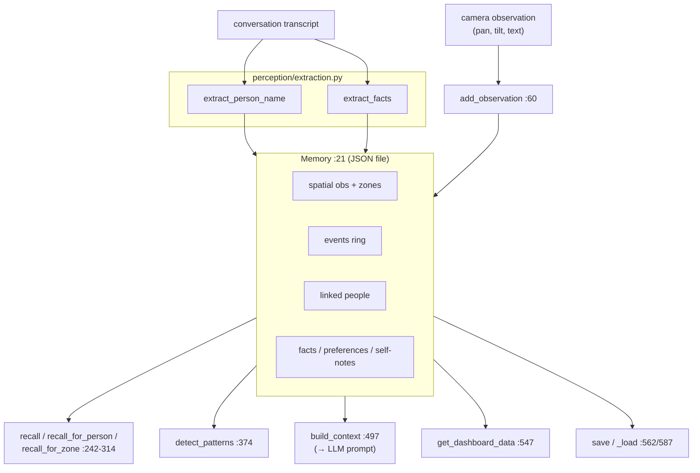

# tritium_lib.utils

**Not a grab-bag — this is Amy's memory.** Despite the generic name, this
package holds one substantial thing: a JSON-file-backed `Memory` that gives an
embodied assistant spatial, episodic, and social recall (where it looked, what
it saw, who it met, what it was told).

**Where you are:** `tritium-lib/src/tritium_lib/utils/`
**Parent:** [`../`](../) — the tritium-lib package map

> **Status: lib-side dual / shelfware (verified 2026-07-11).** The **live**
> Amy memory is SC's own `amy/brain/memory.py`. This lib `Memory` is a
> parallel copy that nothing imports — see "How it's consumed." Named `utils`
> for historical reasons; it is **not** a home for generic helpers.
>
> **Dedup (lane/dual-pkg, 2026-07-11):** the former `extraction.py` here was
> **byte-identical** to the live `perception/extraction.py` (consumed by
> `perception/__init__.py` and SC's `amy/commander.py`). It was removed as a
> dead duplicate — its tests were fully subsumed by
> `tests/perception/test_extraction.py`. Only `Memory` remains; the
> lib-canonical extraction of SC's `amy/brain/memory.py` is still open (see
> the LIB-EXTRACTION proposal, below).

## What it's for

An assistant driving a PTZ camera needs continuity across a session: recall
what it observed at a pan/tilt it's returning to, summarise recent events,
remember a person it linked to a name and a zone, retain facts/preferences it
was told, and detect routine patterns — then fold all of that into the context
string it sends to the LLM each turn. `Memory` is that store, persisted to a
versioned JSON file (with a v2→v3 migration path, `memory.py:618`).

The intake side (pull a person's name and durable facts out of a transcript,
to push into `Memory`) lives in `perception/extraction.py` — the former
byte-identical `utils/extraction.py` was removed (see status note above).

## How it works

## Files

| Module | Key objects | What it does |
|--------|-------------|--------------|
| `memory.py` | `Memory` (`:21`) | The store. Spatial: `add_observation`/`get_nearby_observations`/`register_zone`/`get_zone_at`. Episodic: `add_event`/`get_recent_events`/`generate_session_summary`. Social: `record_person`/`link_person`/`identify_person`. Semantic: `add_fact`/`add_preference`/`add_self_note`/`recall`. Synthesis: `detect_patterns`, `build_context`/`build_people_context`/`build_self_context`, `get_dashboard_data`. Persistence: `save`/`_load` + `_migrate_v2_to_v3`. |

## How it's consumed (verified 2026-07-11)

**No consumer anywhere.** Dated grep for `from tritium_lib.utils` /
`import tritium_lib.utils` across sc/edge/addons: **0 hits.** Tests only
(`tests/test_memory.py`).

The live twin is SC's `amy/brain/memory.py`, which the Amy commander
(`amy/commander.py`) actually uses — and it is **~92% identical** to this
`Memory` (56 diff lines over ~660): this lib copy is already the
de-Amy-ified generalization (generic docstrings, generic default path, adds
`os.makedirs` on save, drops debug prints). SC constructs it with an explicit
`Memory(path=…)`, so the only behavioral deltas are cosmetic. Making lib
canonical (SC re-exports lib `Memory`) is therefore a **low-risk extraction**
— routed as a proposal to the main loop (it needs a canonical module name,
since `utils` is a poor home, plus a cross-submodule test run).

## Related

- `tritium-sc/src/amy/brain/memory.py` — the **live** Amy memory twin
- [../perception/](../perception/) — now the **sole** home of `extraction.py` (the former `utils/extraction.py` byte-identical dup was removed)
- [../inference/](../inference/) — consumes the `build_context()` string an assistant memory produces
