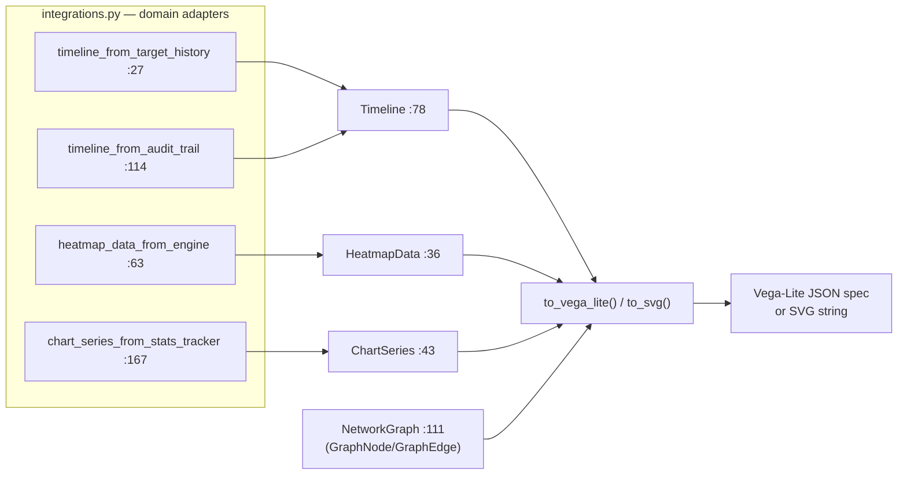

# tritium_lib.visualization

**Data structures that draw themselves — without a plotting library.**
Renderer-agnostic containers for timelines, heatmaps, chart series, and network
graphs. Each holds structured data and exports to a [Vega-Lite](https://vega.github.io/vega-lite/)
JSON spec or a plain SVG string. No matplotlib, plotly, or d3 dependency.

**Where you are:** `tritium-lib/src/tritium_lib/visualization/`
**Parent:** [`../`](../) — the tritium-lib package map

> **Status: shelfware (verified 2026-07-11).** Complete and tested, but no
> runtime consumer — see "How it's consumed." (The Tritium operator UI is
> vanilla-JS canvas/WebGL, not Vega-Lite, which is why these server-side
> exporters never got wired.)

## What it's for

A server-side caller — a report generator, a CLI, an export endpoint — that
wants a chart without pulling a heavyweight rendering stack into the backend.
Build the data structure, call `to_vega_lite()` for a spec a browser can
render, or `to_svg()` for a static string to drop into a report. The
`integrations` module adapts Tritium's own domain objects into these
structures.

## How it works

## Files

| Module | Key objects | What it does |
|--------|-------------|--------------|
| `timeline.py` | `Timeline` (`:78`), `TimelineEvent` (`:19`) | Ordered categorized events on a time axis; `add_event`, `to_vega_lite`, `to_svg`. |
| `heatmap_data.py` | `HeatmapData` (`:36`), `HeatmapBounds` (`:19`) | A spatial activity grid; `set_cell`, geographic bounds, exports. |
| `chart_series.py` | `ChartSeries` (`:43`), `DataPoint` (`:19`) | An (x, y) series (e.g. kills-per-wave); `add_point`, exports. |
| `network_graph.py` | `NetworkGraph` (`:111`), `GraphNode` (`:20`), `GraphEdge` (`:58`) | An entity-relationship graph (target↔target correlations); grouped colouring, exports. |
| `integrations.py` | 4 adapter functions (`:27`–`:167`) | Bridge Tritium domain objects → these structures: `TargetHistory`→`Timeline`, `HeatmapEngine`→`HeatmapData`, `AuditTrail`→`Timeline`, `StatsTracker`→`ChartSeries`. |

## How it's consumed (verified 2026-07-11)

**No consumer anywhere.** Dated grep for `from tritium_lib.visualization`
across sc/edge/addons: **0 hits.** Tests only (4 lib test files). The adapters
in `integrations.py` reference `TargetHistory`/`HeatmapEngine`/`AuditTrail`/
`StatsTracker` under `if TYPE_CHECKING:` guards, so importing this package does
not pull those in — it stays dependency-light and inert.

The operator surface renders charts client-side (canvas/WebGL panels), and
reports go out through `reporting/` (which does its own `to_html`), so these
Vega-Lite/SVG exporters have no live path. They remain a ready server-side
option — e.g. a future "export this timeline as SVG" endpoint would wire
`integrations.timeline_from_target_history` in one line.

## Related

- [../reporting/](../reporting/) — the live report generator (its own `to_html`); a candidate future consumer of these charts
- [../tracking/](../tracking/) — `TargetHistory`/`HeatmapEngine` are the domain sources the adapters convert
- [../audit/](../audit/) — `timeline_from_audit_trail` renders an audit trail (both shelfware — the one internal link)
