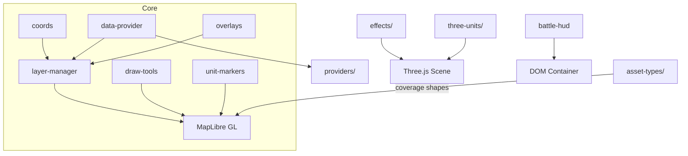

# Tactical Map Components

Reusable MapLibre GL + Three.js modules for rendering the Tritium tactical map (31 JS files).

**Where you are:** `tritium-lib/web/map/`
## Architecture

## Core
| File | Description |
|------|-------------|
| `index.js` | Barrel export for all 31 modules |
| `coords.js` | Coordinate transforms: game meters, WGS84, Mercator; FOV cone/circle geometry |
| `layer-manager.js` | GeoJSON source/layer CRUD with hash-based change detection |
| `data-provider.js` | Base class + registry for extensible map tile/data providers |
| `draw-tools.js` | Polygon/polyline drawing (geofences, patrol routes) with rubber-band preview |
| `unit-markers.js` | DOM markers for units with health bars, labels, alliance colors |
| `overlays.js` | Tactical overlays: patrol routes, weapon range, hazards, crowd density, engagement lines |
| `battle-hud.js` | Screen shake, flash, vignette, wave banners, kill feed, game-over overlay |
## `effects/` -- Combat VFX
| File | Description |
|------|-------------|
| `base.js` | `CombatEffects` lifecycle manager + weapon VFX presets (bullet through flamethrower) |
| `projectile.js` | Tracer/bullet/missile flight path with fading trail |
| `explosion.js` | Expanding sphere at impact point |
| `particles.js` | Debris/sparks radiating outward with gravity |
| `flash.js` | Brief muzzle/hit flash sphere |
| `floating-text.js` | Rising DOM text for damage numbers and streak text |
## `asset-types/` -- Sensor Definitions
| File | Description |
|------|-------------|
| `base.js` | `BaseAssetType` -- coverage shape, range, popup HTML, defaults |
| `registry.js` | Singleton registry; addons register custom sensor types at runtime |
| `camera.js` | Camera: cone, 90-deg FOV, 30m |
| `ble-sensor.js` | BLE scanner: circular, 15m |
| `motion-sensor.js` | Motion detector: cone, 110-deg FOV, 8m |
| `mesh-radio.js` | Mesh radio (LoRa): circular, 500m |
## `three-units/` -- 3D Models
| File | Description |
|------|-------------|
| `base.js` | `Base3DUnit` -- mesh helpers (box, cylinder, sphere), ground ring, disposal |
| `turret.js` | Stationary turret with rotating barrel |
| `drone.js` | Quadrotor with spinning rotor blades |
| `rover.js` | Ground robot chassis with wheels |
| `person.js` | Humanoid figure (body + head) |
| `tank.js` | Tracked vehicle with hull and turret |
## `providers/`
`satellite.js` -- Esri World Imagery + OSM raster tiles. `terrain.js` -- terrain segmentation GeoJSON from `/api/terrain/layer` (60s auto-refresh).
