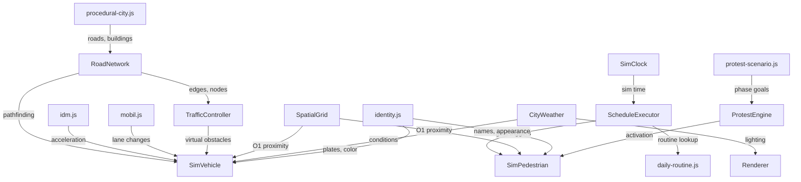

# City Simulation

Browser-side city simulation engine -- traffic physics, pedestrian behavior, protest dynamics, and weather.

**Where you are:** `tritium-lib/web/sim/`

## Simulation Loop

## Modules

| File | Description |
|------|-------------|
| `index.js` | Barrel export for all simulation modules |
| `idm.js` | Intelligent Driver Model (Treiber 2000) -- computes acceleration from gap, speed, and desired velocity |
| `mobil.js` | MOBIL lane change model (Kesting 2007) -- evaluates safety and incentive for lane switches |
| `vehicle.js` | `SimVehicle` -- drives on road edges using IDM physics, Dijkstra routing, and MOBIL lane changes |
| `road-network.js` | Directed graph from OSM roads: intersection merging, adjacency lists, Dijkstra pathfinding |
| `traffic-controller.js` | Traffic signal phases using virtual-obstacle mechanism (red light = phantom stopped car) |
| `pedestrian.js` | `SimPedestrian` -- sidewalk walking, social force avoidance (Helbing 1995), daily routine execution |
| `daily-routine.js` | Goal-based NPC schedules: wake, commute, work, lunch, leisure, home |
| `schedule-executor.js` | `SimClock` (accelerated time) + `ScheduleExecutor` that triggers routine transitions |
| `protest-engine.js` | Epstein civil violence model (2002) -- grievance vs risk drives protest activation |
| `protest-scenario.js` | Eight-phase escalation sequence: call-to-action through riot to aftermath |
| `procedural-city.js` | Generates fictional city data (grid roads, zoned buildings, parks) for demo/offline mode |
| `weather.js` | Day/night cycle, sky colors, fog, rain; provides weather state to vehicles and lighting |
| `spatial-grid.js` | Cell-based spatial index for O(1) proximity queries (replaces O(n^2) neighbor loops) |
| `identity.js` | Deterministic identity generator: names, appearance, license plates seeded by entity ID |

## Key Algorithms

- **IDM**: `a = a_max * [1 - (v/v0)^4 - (s*/s)^2]` where `s*` is desired gap
- **MOBIL**: change lane if `gain - politeness * cost_to_others > threshold` and new follower braking is safe
- **Epstein**: activate if `grievance - risk > threshold` where `grievance = hardship * (1 - legitimacy)`
- **Virtual obstacles**: red lights modeled as phantom stopped cars; IDM brakes naturally behind them
